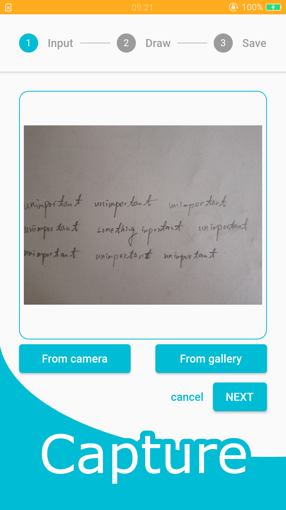
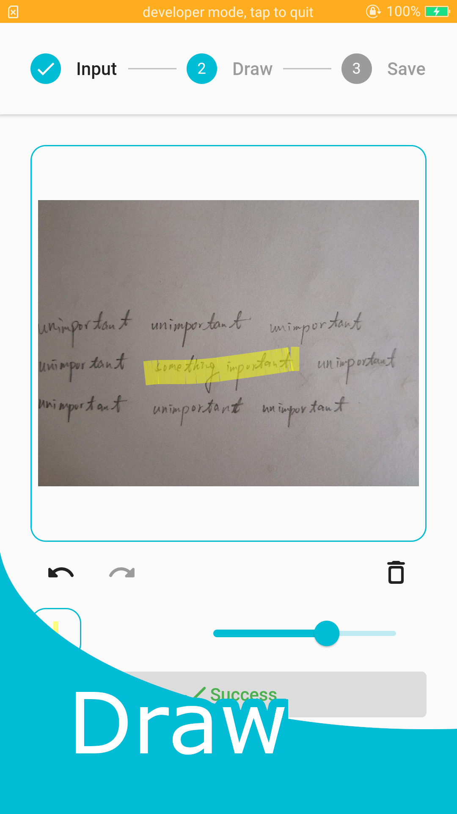
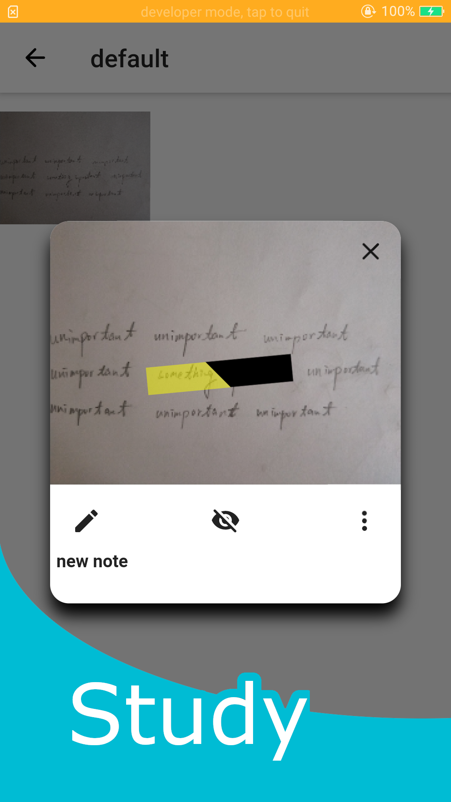
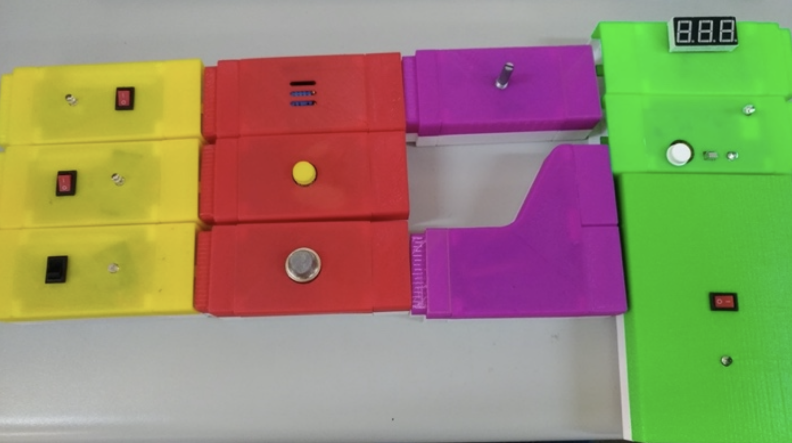
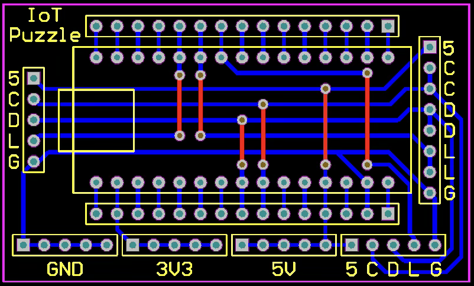
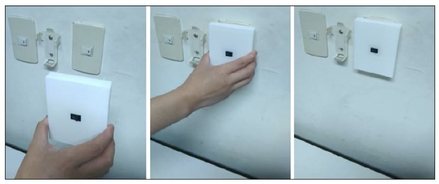
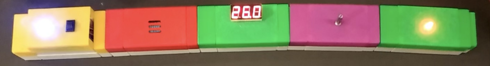

# WeiHan Wu
> **Technical Lead | Senior Software Engineer | Systems & AI Specialist**
> *Bridging the gap between low-level hardware and high-level AI orchestration.*

---

## Professional Vision
I specialize in building stable, scalable systems that solve complex real-world challenges. My journey spans from winning national awards for **modular robotics and IoT hardware** to leading the **virtualization backbone** for global security solutions at TrendAI. Currently, I am focused on the next frontier: **AI Agent Orchestration and LLM-driven system optimization.**

---

## Featured Projects

### 1. AI Security Analyst (TrendAI Hackathon 2nd Place)
*An LLM-powered agentic workflow for automated threat intelligence.*
*   **Tech Stack:** Python, LangChain, LangGraph, OpenAI-Compatible API.
*   **Core Innovation:** Developed a multi-agent system where specialized LLM nodes (Researcher, Analyzer, Reporter) collaborate to triage security logs.
*   **Impact:** Reduced manual analysis time for complex threat patterns and earned **2nd Place** among global engineering teams at TrendAI.

### 2. Pen Power 2.0 (Mobile App)
*Bridging analog study habits with digital efficiency.*
*   **Links:**
    * [GitHub Repo](https://github.com/b8411243/pen_power)
    * *Formerly published on Google Play*
*   **Tech Stack:** Flutter 2.2, Dart, sqflite (Local DB).
*   **Key Features:**
    *   **Instant Conversion:** Uses smartphone camera to convert handwritten notes into digital flashcards.
    *   **Reactive UI:** Built a highly responsive interface with custom color pickers and paginated navigation.
    *   **Offline First:** Implemented a robust local SQL database for zero-latency data access.
*   **Gallery:**
    * Step 1: Take photo
    
    * Step 2: Draw a line
    
    * Step 3: Click to hide/show
    

### 3. XceptionLite: DeepFake Detection (Master's Thesis)
*Efficient deep learning for real-time facial manipulation detection.*
*   **Link:** [Thesis Archive](https://hdl.handle.net/11296/59g92n)
*   **Tech Stack:** Python, Keras, TensorFlow, Computer Vision.
*   **Achievement:** Engineered the **XceptionLite** architecture, which achieved baseline-level accuracy in DeepFake detection while **reducing training time by 35%**.
*   **Innovation:** Combined Xception-based feature extraction with LSTM sequences to detect temporal inconsistencies in manipulated videos.

### 4. IoT Puzzle: Modular Smart Home (Macronix Award Winner)
*A "Zero-Invasive" tangible programming platform for home automation.*
*   **Link:**
    * [Watch Demo](https://www.youtube.com/watch?v=sNoOyA0bjWk)
    * [Silicon Awards Manual](https://www.mxeduc.org.tw/SiliconAwards/history/2018/article/docs/A18-026.pdf)
*   **Tech Stack:** ESP32, Arduino, BLE, PCB Design.
*   **Innovation:**
    *   **Bi-direction Interface:** Leveraging USB Type-c connector, direction-less connectors for simultaneous 5V power and I2C data delivery.
    *   **Screenless Logic:** A physical "If-Then" logic engine where snapping blocks together (e.g., Light Sensor + Smart Lamp) automatically generates cloud rules without code.
*   **Gallery:**
    * Puzzle:
    
    * Self-designed PCB board:
    
    * Use case: Light conrol module
    
    * Use case: Temperature detect
    

### 5. RobotCubes: Reconfigurable Robotics (Macronix Award Winner)
*Self-assembling modular robots with distributed intelligence.*
*   **Link:**
    * [Watch Demo](https://www.youtube.com/watch?v=pJ58TnMh-0A)
    * [Silicon Awards Manual](https://www.mxeduc.org.tw/SiliconAwards/history/2017/article/docs/A17-108.pdf)
*   **Tech Stack:** STM32, Embedded C, IR Transceivers.
*   **Innovation:**
    *   **Momentum-Based Motion:** Designed internal flywheels allowing cubes to roll and jump autonomously.
    *   **Swarm Intelligence:** Implemented local peer-to-peer communication for cubes to self-assemble into complex shapes like snakes or quadruped walkers.

---

## Honors & Recognition
*   **2nd Place:** TrendAI AI Hackathon (2025)
*   **Champion (Gold Medal):** Ministry of Education Creative Software Contest (2016, 2018)
*   **Champion:** National Industry 4.0 Competition (2017)
*   **Champion:** Chunghwa Telecom Digital Innovation IoT Platform (2018)
*   **Silver/Bronze Medals:** 17th & 18th Macronix Golden Silicon Awards (2017, 2018)
*   **Third Place:** National Microprocessor Application System Design Contest (2017)

---

## Technical Skills
*   **Languages:** Python, C, C++, Bash, Java.
*   **Systems & Infrastructure:** Linux Kernel, Custom OS Development (ISO Packaging), Virtualization (QEMU/KVM, Type-2 Hypervisors), Rocky Linux/RHEL, Nested Virtualization.
*   **AI & ML:** LLM Orchestration (LangChain, LangGraph), AI Agent Design, Deep Learning (Keras/TensorFlow), Computer Vision (OpenCV).
*   **Tools & DevOps:** Docker, Podman, Jenkins, GitHub Actions, CI/CD Pipeline Automation, Git.

---

## Connect with Me
*   **LinkedIn:** [linkedin.com/in/weihanwu1995](https://www.linkedin.com/in/weihanwu1995)
*   **GitHub:** [github.com/b8411243](https://github.com/b8411243)
